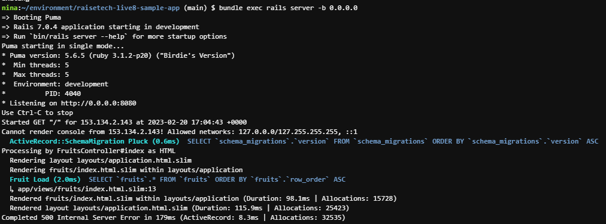
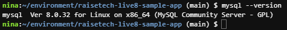
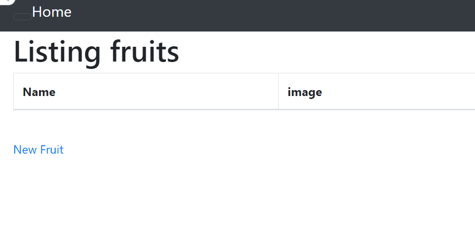
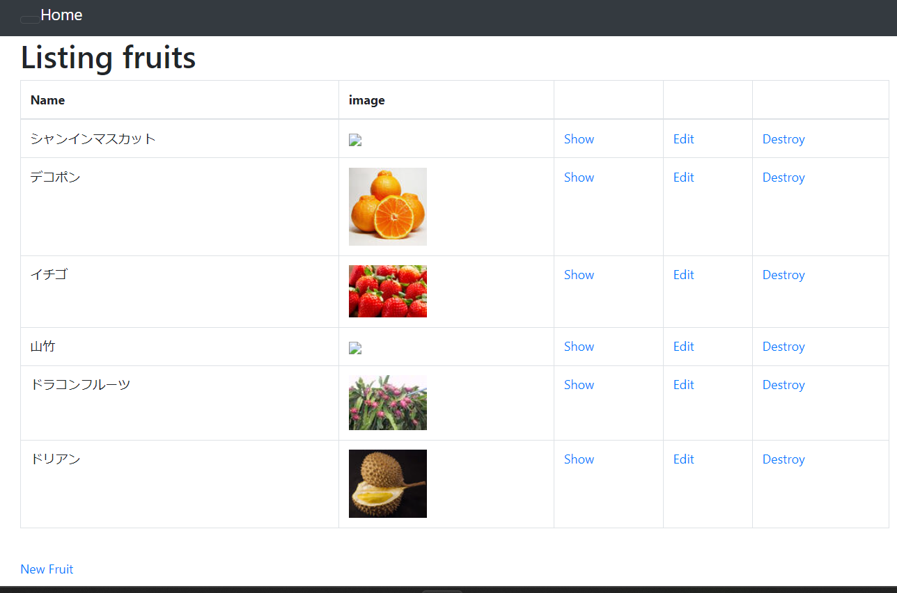

第3回課題
### サンプルアプリケーションを今日見せた作業と同じように起動（デプロイ）してみましょう。
- git clone https://github.com/yuta-ushijima/raisetech-live8-sample-app
### AP サーバーについて
- アプリケーションサーバーとはRubyやPHP、Javaなどで構築されたプログラムを動かすサーバーのことです。
- 複数のユーザーで利用するWebアプリケーションでは、プログラムを動作させるサーバーが必要になってきます。
- この時、実際にプログラムを動作させるサーバーをアプリケーションサーバーと言います。
### AP サーバーの名前とバージョンを確認してみましょう。
- Puma version: 5.6.5　 
- Rails 7.0.4 application starting in development

### AP サーバーを終了させた場合、引き続きアクセスできますか？結果を確認して、また AP サーバーを起動してください。
- sudo service mysql stop できないです。
- No application seems to be running here!
- sudo service mysql restart 再起動
### DB サーバーについて調べてみましょう。
- （database Server）DBサーバ（データベースサーバ）とは、データを一元管理し、データの検索、更新、保存、バックアップを行うサーバのことです。Web3層構造のWebシステムでは最下層に位置し、APサーバからの要求に基づきデータの検索やデータの更新（追加、修正、削除）を行っています。
- mysql  Ver 8.0.32 for Linux on x86_64 (MySQL Community Server - GPL)

### DB サーバーを終了させた場合、引き続きアクセスできますか？
- できないです。
### Rails の構成管理ツールの名前は何でしたか？確認してみてください。
- bundler
### Rails 起動（不思議なことなぜかシャンインマスカットと山竹の画像が出ていない）

### 今回の課題から学んだことを報告してください。
- 毎日1時間勉強しようと思いましたが、ついに夜中1時半2時半になってしまいました。何日かかってしまって、やっと課題が提出できるようになりました。
could9でアプリケーションの起動とインストールの流れについて、いい勉強になりました。
呑み込みが遅いかもしれませんが、1月前の自分に比べて、いろんな知識が身につけて、うれしかったです。
第3回の課題をやっている途中、第1回と第2回の課題を何をやったかすっかり忘れてしましました。第1回、第2回の内容も復習しました。
第3回の課題は完成まで繰り返して3回目やっていました。
### 通信について
- JSON XML
### HTTP メソッド
## GET POST
- GET: 情報を取得したい時に利用します。
- POST:情報の登録・更新などを行いたい時に利用します。
### HTML(HyperTextMarkup Language)
-  HTMLはブラウザで画面描画を行うときに使う言語です。
### CSS(Cascading Style Sheets)
- HTMLで書かれたものをスタイリングするもので、スタイルシートとも呼ばれます。
### JS(JavaScript)
* JSはプログラミング言語です。
### システム(アプリケーション)開発の流れ
* W 字モデルとV字モデル
* ウォーターフォール
* アジャイル
* スクラム
### bundlerについて
- gemのバージョンやgemの依存関係を管理してくれるgemです。
- bundlerを使うことで、複数人での開発やgemのバージョンが上がってもエラーを起こさずに開発できます。

### 第3回課題に使うコマンドをまとめました。
- sudo yum updata -y
- ruby -v
- rvm -v
- rvm get head
- rvm list known
- rvm install 3.1.2
- rvm list
- bundle install 
- docker system prune -a 
- curl -fsSL https://raw.githubusercontent.com/MasatoshiMizumoto/raisetech_documents/main/aws/　　scripts/mysql_amazon_linux_2.sh | sh

- sudo cat /var/log/mysqld.log | grep "temporary password" | awk '{print $13}'
- sudo service mysqld start
- sudo service mysqld status
- sudo service mysql stop
- sudo service mysql restart
-  mysql --version
- mysql -u root -p
- ALTER USER 'root'@'localhost' IDENTIFIED BY '設定するパスワード';
-  bundle exec rails db:create
-  bundle exec rails server -b 0.0.0.0
- bin/dev
-  npm install -g yarn
- yarn install
- yarn build
